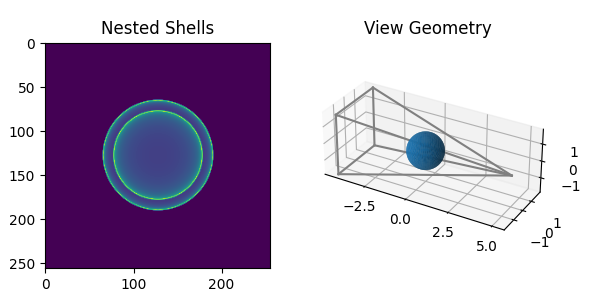

# sph_raytracer

A PyTorch volume raytracer in spherical coordinates.

## Quickstart

    pip install sph_raytracer
    python example.py

## Memory Usage

This library was implemented very simply using only PyTorch array operations at the expense of memory consumption.  The peak memory usage in GB of this library can be approximated with the following expression

    #                        points             indices   intersection_length
    #                           |                    |       |
    mem = num_rays * (2 * nrad + 2 * nele + nazi) * (4 * 8 + 8) / 1e9
    
- `num_rays` - total number of rays across all measurement positions
- `nrad` - radial bins of volume
- `nele` - elevation bins of volume
- `nazi` - azimuthal bins of volume

## Running Tests

    pytest sph_raytracer/tests.py
    
## See Also

[tomosipo](https://github.com/ahendriksen/tomosipo), which inspired parts of this library's interface.
