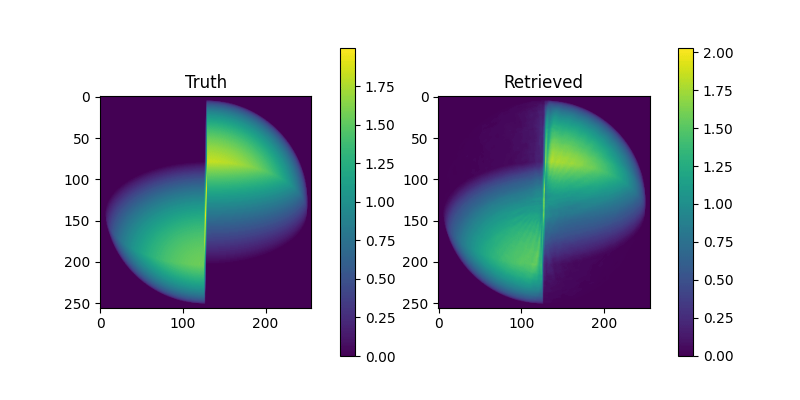
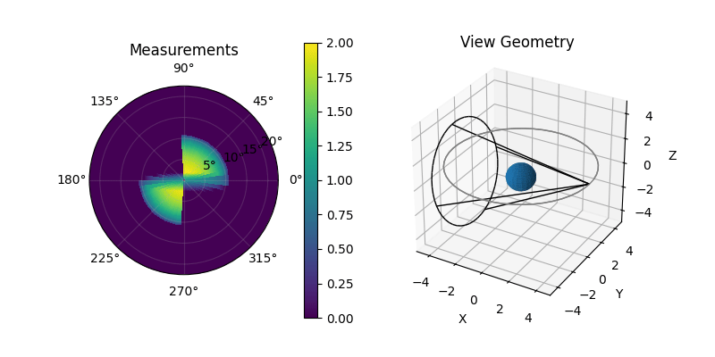

# sph_raytracer

A 3D/4D volume raytracer in spherical coordinates implemented in PyTorch.

Check `examples/` for samples demonstrating forward raytracing and retrieval.

## Features

- 3D spherical raytracing with optional support for evolving volume (4D)
- implemented purely in PyTorch for easy integration with PyTorch's optimization and machine learning capabilities
- support for custom detector shapes/sizes
- optional retrieval framework for easily defining loss functions and parametric models

## Quickstart

    pip install -e .
    python examples/single_vantage.py

    python examples/static_retrieval.py

## Memory Usage

This library was implemented very simply using only PyTorch array operations at the expense of memory consumption.  The peak memory usage in GB of this library can be approximated with the following expression

    #                        points             indices   intersection_length
    #                           |                    |       |
    mem = nrays * (2 * nrad + 2 * nele + nazi) * (4 * 8 + 8) / 1e9
    
- `nrays` - total number of rays across all viewing geometries
- `nrad` - number of radial bins of spherical grid
- `nele` - number of elevation bins of spherical grid
- `nazi` - number of azimuthal bins of spherical grid

## Architecture

Below is a list of modules in this package and their purpose:

Forward Raytracing

- `raytracer.py` - computation of voxel indices for intersecting rays, line integration
- `geometry.py` - viewing geometry definitions, spherical grid definition

Retrieval

- `model.py` - parameterized models for representing a density.  used in retrieval
- `loss.py` - some loss functions to be used in retrieval
- `retrieval.py` - retrieval algorithms
- `plotting.py` - functions for plotting stacks of images, retrieval losses

## Running Tests

    pytest sph_raytracer/tests.py
    
## See Also

[tomosipo](https://github.com/ahendriksen/tomosipo), which inspired parts of this library's interface.
